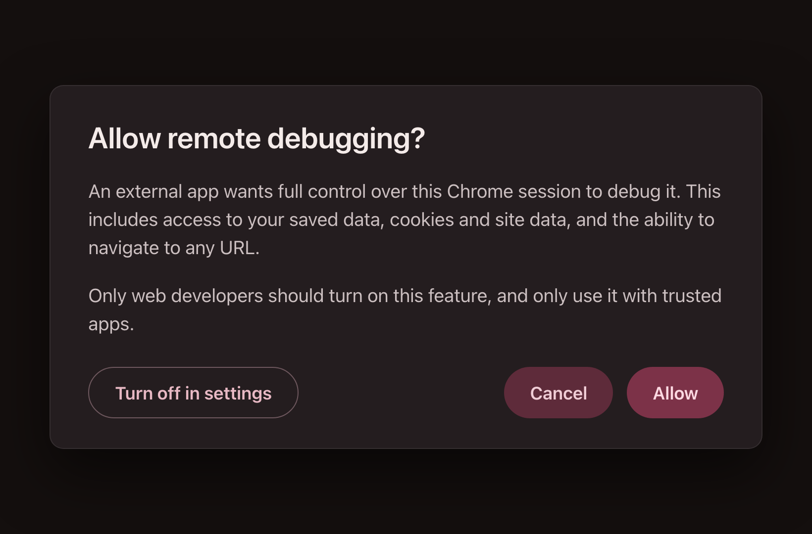

# chrome-allow-debug

Auto-approve Chrome's native **"Allow remote debugging?"** consent dialog on macOS — and *only* that dialog.

<p align="center">
  
</p>

## The problem

Recent Chromium builds (Chrome, Edge, Brave, …) show a native macOS consent sheet the moment an external app attaches over the DevTools/CDP protocol:

> **Allow remote debugging?**
> An external app wants full control over this Chrome session to debug it…
> `[ Turn off in settings ]  [ Cancel ]  [ Allow ]`

That's a good safety default, but it's a papercut if you drive Chrome constantly — Playwright/Puppeteer, the Chrome DevTools MCP server, CDP scripts, screenshot pipelines. The sheet is **native browser UI**, so it can't be clicked through the DevTools protocol itself: you have to approve it *before* the protocol gets control. Chicken and egg.

This tool watches for that specific sheet and presses **Allow** for you, using the macOS Accessibility API.

## Only that dialog

The watcher clicks **only** when *both* conditions hold:

1. the element is a modal **`AXSheet`** whose descendant text contains **"debug"**, and
2. the button's accessibility label is exactly **"Allow"**.

Web permission bubbles (location, notifications, camera) aren't sheets. Other native sheets (print, save, file pickers) don't contain that text. So nothing else is ever touched.

## How it works

- **`ChromeAllowDebug.app`** — a tiny Swift program that talks to the Accessibility API (`AXUIElementPerformAction`) directly. It needs exactly **one** permission: Accessibility. (No AppleScript/Automation layer.)
- **launchd agent** (`com.yoav.chrome-allow-debug`) — keeps it running in the background, at login, forever. Polls once per second.
- **`chrome-allow-debug`** — an optional CLI (AppleScript under the hood) for one-off manual approvals from a terminal that already has Accessibility.

Why a compiled `.app` and not just a shell script under launchd? A `script → osascript` chain launched by launchd has no stable identity to grant Accessibility to, so macOS silently blocks it. A signed app bundle is a clean, single, toggleable entry in the Accessibility list.

## Requirements

- macOS 12+
- Xcode or the Command Line Tools (`xcode-select --install`) — for `swiftc`

## Install

```sh
git clone https://github.com/gergesh/chrome-allow-debug.git
cd chrome-allow-debug
./install.sh
```

Then do the **one manual step** the installer can't do for you: in **System Settings › Privacy & Security › Accessibility**, enable **ChromeAllowDebug** (the installer opens this pane for you). If it isn't listed, click **+**, press ⌘⇧G, and add `~/Applications/ChromeAllowDebug.app`.

No restart needed — the daemon re-checks every second and starts working the instant you enable it.

> macOS only lets *you* grant Accessibility, never a script — that's the whole point of the permission. This one toggle is unavoidable for anything that clicks native OS UI.

## Usage

Once installed and granted, it's fully automatic. To watch it:

```sh
tail -f ~/Library/Logs/chrome-allow-debug.log
```

Manual CLI (no daemon needed, but your terminal needs Accessibility):

```sh
chrome-allow-debug            # approve once, if the dialog is showing
chrome-allow-debug --watch    # poll and approve until you Ctrl-C
chrome-allow-debug -p "Brave Browser"   # target another Chromium browser
```

## Managing the daemon

```sh
launchctl bootout   gui/$(id -u)/com.yoav.chrome-allow-debug   # stop / disable
launchctl bootstrap gui/$(id -u) ~/Library/LaunchAgents/com.yoav.chrome-allow-debug.plist  # start
launchctl kickstart -k gui/$(id -u)/com.yoav.chrome-allow-debug # restart
```

## Uninstall

```sh
./uninstall.sh
```

(Then remove the leftover, now-broken "ChromeAllowDebug" row from the Accessibility list with the **–** button if you want a tidy list.)

## Supported browsers

Chrome (stable/beta/canary/dev), Chromium, Brave, Microsoft Edge, Vivaldi, Opera — anything Chromium-based that shows this sheet. Edit `targetBundleIDs` in `Sources/ChromeAllowDebug.swift` to add more.

## Caveats

- **Keeps the browser's accessibility tree enabled.** Any AX-based tool does this; the overhead is negligible in practice.
- **Ad-hoc signed.** Because there's no Developer ID, macOS may occasionally ask you to re-enable it in Accessibility after a rebuild/update. It's a one-toggle fix when it happens.
- **English UI.** Matching keys on the literal strings "debug" and "Allow". Localized Chrome would need those adjusted.
- Turning the prompt off entirely (no tool needed) is also possible via the browser's own `#remote-debugging-*` settings, but that disables the safeguard globally; this tool keeps it and just answers it for you.

## License

MIT — see [LICENSE](LICENSE).
